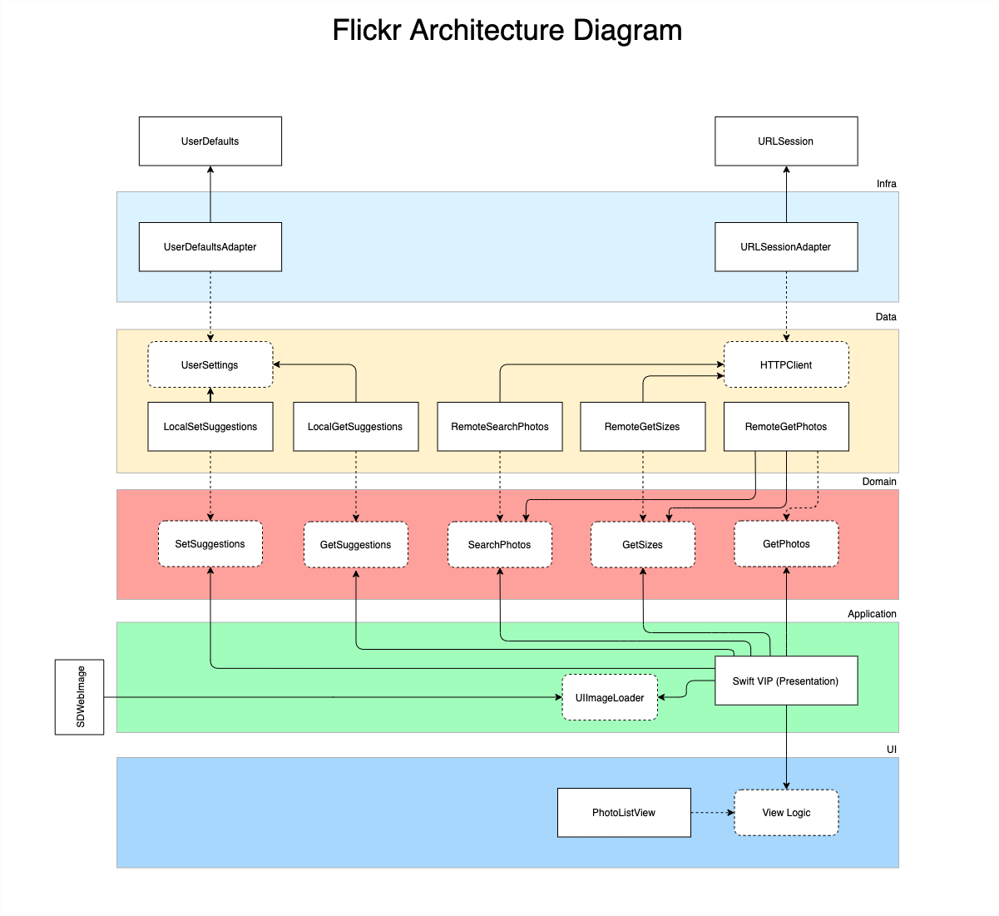

 

# Flickr
An iOS application written in Swift using the Clean Architecture design that consumes the Flickr REST API.

## Dependencies
- Cocoapods 1.10.1
- SDWebImage 5.11.0
- Ruby 2.6.3

## Project Structure

- **Flickr** (app target)
- **Application**: application layer target implemented with the Clean Swift pattern.
- **UI**: contains the whole UI abstractions and implementations used by the application. It's implemented with SnapKit.
- **Domain**: contains the application's use cases abstractions and the core entities.
- **Data**: contains the use cases implementations and external interfaces abstractions.
- **Infra**: contains the implementation of the external interfaces abstractions like an http client.

## Instructions

Make sure you have a Xcode version compatible with Swift 5. Follow the instructions below to install rbenv and make sure your environment is same as the one that built this project. If you think this isn't an issue in your machine, you can skip the steps below by running `pod install` at the project's root directory.

### Install bundler

`brew install bundler`

### Install Rbenv

`curl -fsSL https://github.com/rbenv/rbenv-installer/raw/master/bin/rbenv-installer | bash`

### Install project's ruby version

`rbenv install`

### Install project's gem dependencies

`bundle install`

### Install project's iOS dependencies

`bundle exec pod install`

Once that is done, you are free to run the app.

Choose between the following schemes:
- **Flickr**: Run this scheme to run the app.
- **Application**: Build this scheme to create the application layer framework (or **Cmd + U** to run its unit tests).
- **UI**: Build this scheme to create the UI layer framework (or **Cmd + U** to run its unit tests).
- **Domain**: Build this scheme to create the Domain layer framework.
- **Data**: Build this scheme to create the Data layer framework (or **Cmd + U** to run its unit tests).
- **Infra**: Build this scheme to create the Infra layer framework (or **Cmd + U** to run its unit tests).
- **UseCaseIntegrationTests**: **Cmd + U** to run the integration tests for several use cases.

## Dependency Diagram

